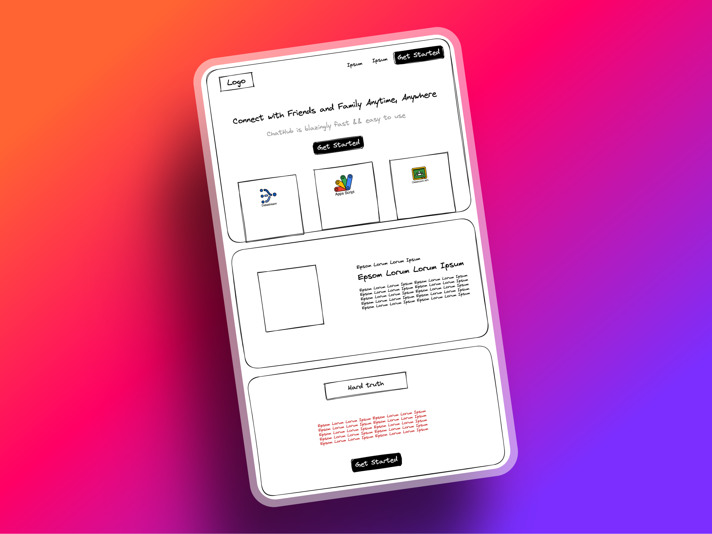
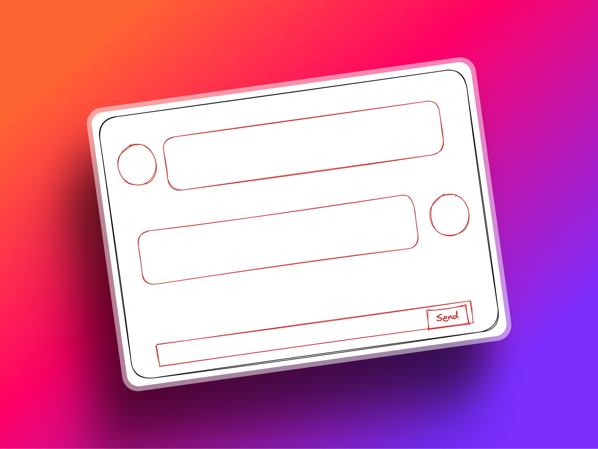

<h1 align='center'>ChatHub 💬</h1>

## 📓 Description

ChatHub is a real-time chat application built with React.

## 🖥️ Demo

[View Demo](https://discord.com/channels/@me/746093040271229058/1104136176396410910)

## ⚙️ Project Status 🛠️

```js
const project = {
  status: 'In development'
}
```

## 🖌️ Wireframe

Landing page

<p align="center">
  
</p>

Chat page

<p align="center">
  
</p>

Wireframes might differ from final result

## 📸 App Shots

<p align="center">
  
</p>

## 🗺 Project Management

ClickUp is used to manage implementation of project features (Kanban)

Made with ❤️ by Joselson and sleepless nights
